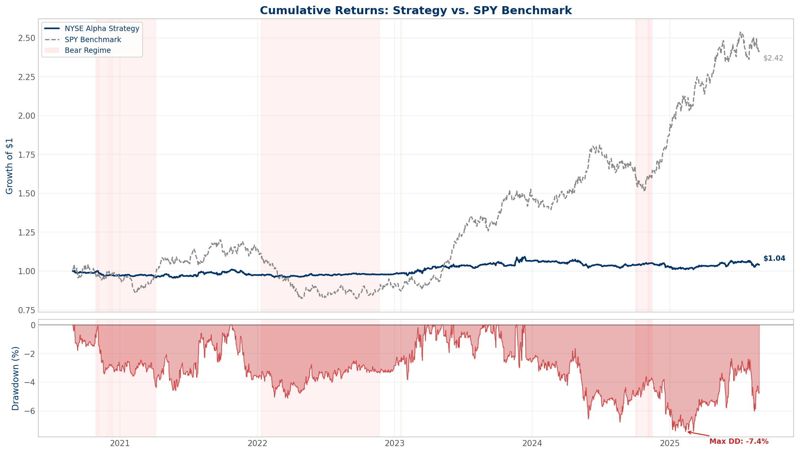
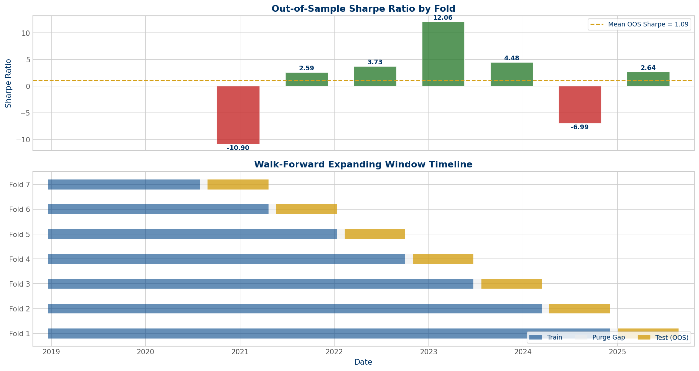
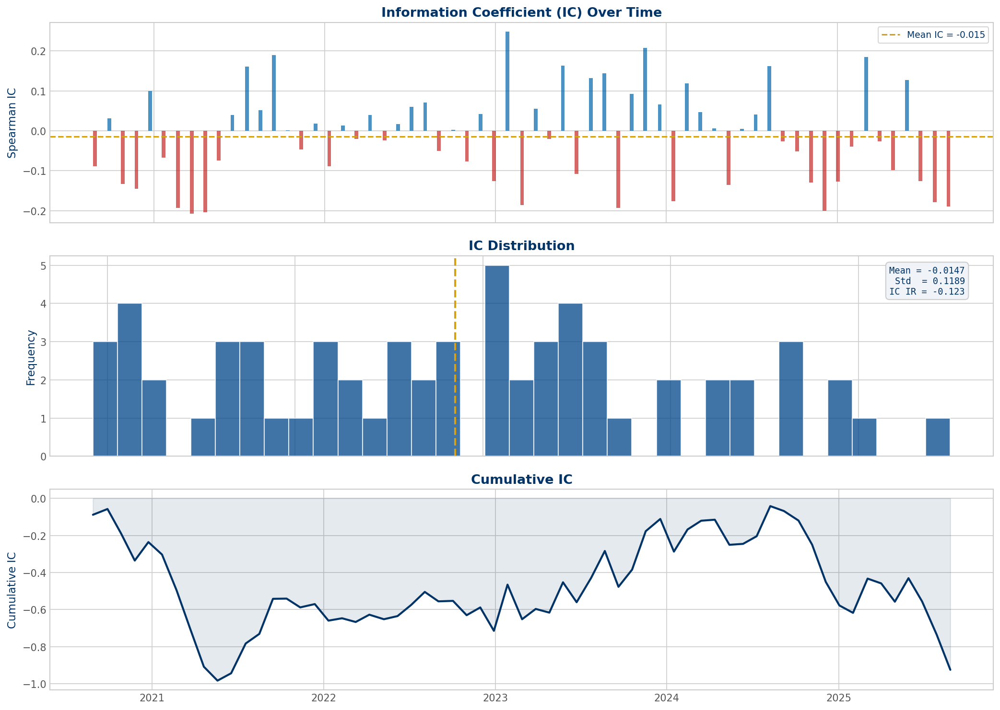
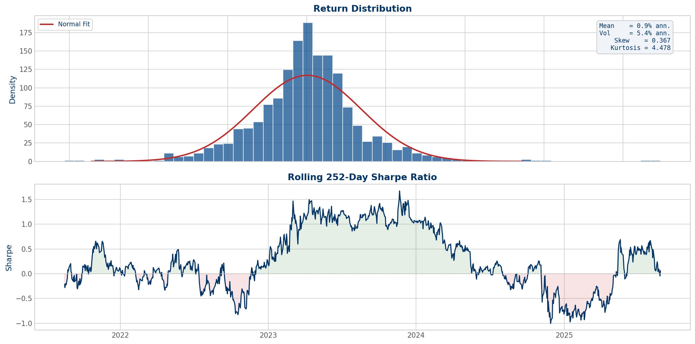
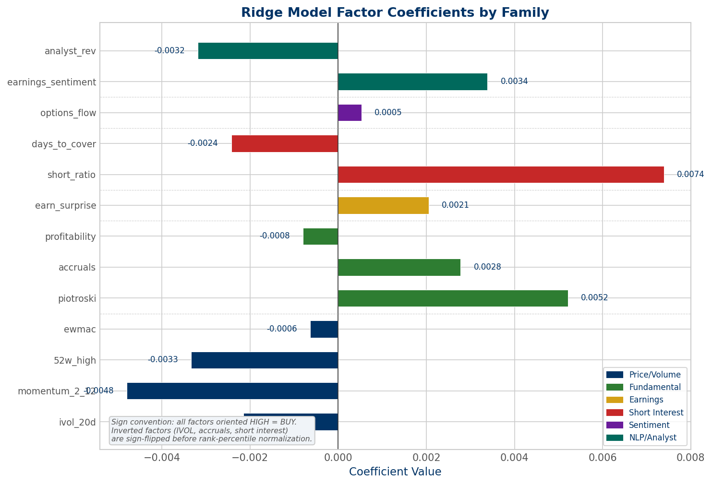
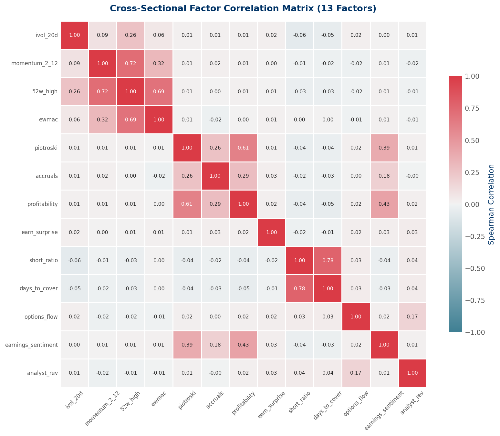

# NYSE Trading Framework & Alpha Generation Pipeline

**Current System Reference | v0.6 | April 2026**

> **Status (2026-04-18):** Research pipeline complete through Phase 4 | 998 tests passing | **Factor admission on real 2016-2023 S&P 500 data: 0 of 6 Tier-1 / Tier-2 factors pass G0-G5** (ivol_20d, high_52w, momentum_2_12, piotroski, accruals, profitability all FAIL — see `OUTCOME_VS_FORECAST.md` §Live Forecasts) | Ensemble unbuildable until at least one factor is admitted | Pre-registered abandonment criteria A1-A12 now frozen (`docs/ABANDONMENT_CRITERIA.md`) — A1 is 4 factors away from firing | Calibration Brier score 0.61 at n=7 (probability-bucketed; `docs/CALIBRATION_TRACKER.md`) / 1.00 at n=7 (hard 0/1; `docs/OUTCOME_VS_FORECAST.md` §Calibration) — methodology note reconciles both views | Holdout (2024-2025) intact; lockfile absent | **AI/ML governance policy published** (`docs/AI_GOVERNANCE.md`: CO AI Act + TX HB 149 + SR 11-7 + SEC Reg BI + EU AI Act; autonomy ladder A0-A4; retraining approval gate) | Phase 5 paper trading **NOT imminent** — blocked on ≥3 admitted factors or abandonment-criteria decision | Next: Tier-3 factor screens (options flow, analyst revisions, NLP) + regime-conditional variants + 20-day horizon re-screens

This document describes the system as it exists today -- modules, data flow, configuration, and risk management. It is the single source of truth for how the NYSE ATS framework operates.

**Related documents** (pick the depth you need):
- [NYSE_ALPHA_ONE_PAGER.md](NYSE_ALPHA_ONE_PAGER.md) -- One-page strategy pitch for prospective collaborators
- **This document** -- System reference (architecture, pipeline, scripts, configs, risk)
- [NYSE_ALPHA_TECHNICAL_BRIEF.md](NYSE_ALPHA_TECHNICAL_BRIEF.md) -- Statistical evidence and methodology
- [NYSE_ALPHA_RESEARCH_RECORD.md](NYSE_ALPHA_RESEARCH_RECORD.md) -- Full research history by phase
- [OUTCOME_VS_FORECAST.md](OUTCOME_VS_FORECAST.md) -- Live prediction-vs-outcome ledger (per-forecast)
- [CALIBRATION_TRACKER.md](CALIBRATION_TRACKER.md) -- Rolling Brier score (aggregate calibration)
- [ABANDONMENT_CRITERIA.md](ABANDONMENT_CRITERIA.md) -- Pre-registered pre-live stop thresholds (A1-A12)
- [MODEL_VALIDATION.md](MODEL_VALIDATION.md) -- SR 11-7-style validation report (draft)
- [INDEPENDENT_VALIDATION_DRAFT.md](INDEPENDENT_VALIDATION_DRAFT.md) -- Independent-voice validation scaffolding
- [AI_GOVERNANCE.md](AI_GOVERNANCE.md) -- AI/ML governance policy (CO AI Act, TX HB 149, SR 11-7, SEC Reg BI, EU AI Act; autonomy ladder, retraining approval, incident response)
- [MLOPS_LIFECYCLE.md](MLOPS_LIFECYCLE.md) -- Model lifecycle: training, registry, deployment, drift, retraining
- [DISASTER_RECOVERY.md](DISASTER_RECOVERY.md) -- Incident response runbooks and RPO/RTO targets
- [AUDIT_TRAIL.md](AUDIT_TRAIL.md) -- Hash-chained research log + decision ledger
- [SEC_FINRA_COMPLIANCE.md](SEC_FINRA_COMPLIANCE.md) -- Rule 15c3-5, Rule 606, FINRA 2090/2111 mapping
- [REVIEW_CHECKLIST.md](REVIEW_CHECKLIST.md) -- Pre-deployment review checklist
- [Plan](/.claude/plans/dreamy-riding-quasar.md) -- Full architectural plan with phase breakdown

---

## Glossary

| Term | Meaning |
|---|---|
| **Factor** | A numeric column describing a stock characteristic (e.g., idiosyncratic volatility, Piotroski F-score). One column per factor in the feature matrix. |
| **IC** | Information Coefficient -- Spearman rank correlation between factor scores and realized forward returns. Range: -1 to +1. Above 0.02 is useful for gate admission. |
| **IC_IR** | IC Information Ratio -- mean(IC) / std(IC). Measures signal consistency. Above 0.5 is required for G3 gate. |
| **Sharpe Ratio** | Risk-adjusted return: mean(return) / std(return) * sqrt(252). Above 0.8 is the target; above 0.5 is acceptable. |
| **Alpha** | Excess return above the S&P 500 benchmark. Not to be confused with Ridge regularization strength. |
| **bps** | Basis points. 1 bps = 0.01%. On a $100,000 trade, 10 bps = $100 in friction. |
| **ADV** | Average Daily dollar Volume (20-day). Used to compute dynamic spread cost: spread proportional to 1/sqrt(ADV). |
| **SPY** | SPDR S&P 500 ETF -- the benchmark for regime overlay and beta calculations. |
| **Ridge Regression** | Linear model with L2 regularization that prevents overfitting by penalizing large coefficients. Default combination model (alpha=1.0). |
| **GBM** | Gradient Boosting Machine (LightGBM). Alternative combination model, gated: must beat Ridge by >0.1 OOS Sharpe AND overfit ratio <3.0. |
| **Neural** | PyTorch 2-layer MLP. Same gating criteria as GBM. |
| **Walk-forward CV** | Train on older data, test on newer data, expand the training window forward, repeat. Simulates real-world deployment with no lookahead. |
| **Purge** | Delete data near the train/test boundary so forward return labels cannot leak into training. Auto-adjusts to target horizon (5d or 20d). |
| **Embargo** | Skip additional days after the test window before training data from that region can be reused. |
| **Sell buffer** | Hysteresis to avoid unnecessary trading. If top_n=20 and sell_buffer=1.5, keep a stock as long as it ranks in the top 30 (20 x 1.5). Only sell if it drops below rank 30. |
| **Regime** | Bull or bear market classification. SPY > SMA200 = BULL (100% exposure); SPY < SMA200 = BEAR (40% exposure). |
| **PCA** | Principal Component Analysis -- used for factor deduplication. Selects the highest-IC representative factor per principal component. |
| **GICS** | Global Industry Classification Standard -- used for sector cap enforcement (no sector >30%). |
| **VETO** | A falsification trigger that halts live trading immediately and switches to paper mode. |
| **WARNING** | A falsification trigger that alerts the operator and reduces exposure to 60%. |
| **Diagnostics** | Every `nyse_core` public function returns `(result, Diagnostics)`. Diagnostics is a mutable list of messages with levels (DEBUG/INFO/WARNING/ERROR) -- the only traceability mechanism. No logging imports in nyse_core. |

---

## 1. System Overview

*This section shows the end-to-end pipeline at a glance -- how market data flows in, gets transformed into stock predictions, and comes out as trading decisions, with safety checks at every stage.*

The system is a cross-sectional S&P 500 equity strategy. Each week it:
1. Downloads OHLCV data for ~500 stocks (FinMind), fundamentals (EDGAR), short interest (FINRA)
2. Enforces point-in-time constraints (no future data leakage)
3. Computes 13+ numeric characteristics (factors) per stock across 5 families
4. Winsorizes at 1st/99th percentile, normalizes to rank-percentile [0, 1], imputes missing values
5. Feeds them to a Ridge regression model that scores every stock
6. Buys the top 20 highest-scoring stocks, equal-weight
7. Applies a 10-layer risk stack: regime overlay, position caps, sector caps, beta bounds, loss limits, earnings caps, kill switch, position inertia, sell buffer, anti-double-dip
8. Generates a `TradePlan` consumed by NautilusTrader for TWAP execution

### Pipeline Architecture

```
S&P 500 Universe (~500 stocks, weekly, Fri signal → Mon exec)
+--------------------+----------------+-----+-------------+
|                    |                |     |             |
| PRICE/VOLUME       | Factor scores  |     |             |
|   ivol (sign=-1)   |  winsorize     |     |             |
|   (market-model    |  1st/99th pct  |     |             |
|    residual OLS)   |  rank-pctile   |     |             |
|   52w_high         |  [0, 1]        |     |             |
|   momentum_2_12    |  NaN → median  |     |             |
|                    |                |     |             |
| FUNDAMENTAL        | Factor scores  |     |             |
|   piotroski        |  rank-pctile   |  R  |  Combined   |
|   accruals (-1)    |  [0, 1]        |  i  |  alpha      |
|   profitability    |                |  d  |  score      |
|                    |                |  g  |             |
| EARNINGS           | Factor scores  |  e  |  = Σ(w_i    |  Portfolio
|   earn_surprise    |  rank-pctile   |     |    × f_i)   |
|   analyst_rev      |  [0, 1]        |  /  |             |  Top 20
|                    |                |     |  (Ridge     |  × equal wt
| SHORT INTEREST     | Factor scores  |  G  |   or GBM/   |  × regime
|  short_ratio  (-1) |  rank-pctile   |  B  |   Neural    |
|  short_int_pct(-1) |  [0, 1]        |  M  |   if gated) |  Bull: 100%
|  short_change (-1) |                |     |             |  Bear:  40%
|  (FINRA 11d lag)   |                |  /  |  → single   |
|                    |                |     |    score    |  Sell buffer
| NLP EARNINGS       | Factor scores  |  N  |    per      |  = 1.5
|  earn_sentiment    |  rank-pctile   |  e  |    stock    |
|  sent_surprise     |  [0, 1]        |  u  |    per      |  Cost:
|  sent_dispersion   |                |  r  |    week     |  ~10-15 bps
|                    |                |  a  |             |  dynamic
|                    |                |  l  |             |  ADV-based
+--------------------+----------------+-----+-------------+
|                                                         |
|  Data: FinMind + EDGAR XBRL + FINRA short interest      |
|  Risk: 8 falsification triggers (2 VETO, 6 WARNING)    |
|  Ops:  Weekly (Fri signal → Mon TWAP via Nautilus)      |
+---------------------------------------------------------+
```

### 1.1 Backtest Performance at a Glance

**Strategy vs SPY benchmark equity curve (synthetic 8-year backtest, 5 years OOS)**, with bear-regime shading and drawdown subplot:



**Per-fold OOS Sharpe and walk-forward timeline:**



| Metric | Synthetic Demo | Target (Real Data) |
|--------|---------------|-------------------|
| OOS Sharpe | 0.17 | 0.8 -- 1.2 |
| CAGR | 0.78% | 18 -- 28% |
| Max Drawdown | -7.45% | -15% to -25% |
| Mean IC | -0.015 | > 0.03 |
| IC IR | -0.123 | > 0.50 |
| Annual Turnover | 4.8x | < 50% |
| Cost Drag | 0.19% | < 3% |
| Win Rate | 51% | > 52% |
| OOS Period | 2020-08 to 2025-08 | 2016-2025 |
| Walk-Forward Folds | 7 (5 positive) | >= 4 |
| Factors Used | 13 (5 families) | 13-16 |

> **Important caveat:** These metrics are from a synthetic 100-stock, 8-year demonstration backtest (2018-2025) using all 13 factors across 5 families (Price/Volume, Fundamental/Earnings, Short Interest, NLP Earnings) with 7 walk-forward expanding folds covering 5 years of OOS data (2020-2025). They validate that the full pipeline machinery works correctly -- the infrastructure produces sensible outputs with proper walk-forward discipline. Real performance on S&P 500 historical data is expected to differ substantially. The synthetic Sharpe of 0.17 is not a performance claim; it confirms the system does not have obvious bugs (negative Sharpe) or lookahead bias (suspiciously high Sharpe). The negative mean IC is expected with synthetic data where factor-return relationships are weak by design.

### 1.2 Known Limitations and Honest Uncertainty

**What this system cannot do:**

1. **Narrow-leadership rallies.** Equal-weight top-N structurally underperforms cap-weighted indices during periods when a few mega-caps drive all returns (e.g., AI/semiconductor rallies). This is a known limitation of cross-sectional strategies, not signal decay. The TWSE system experienced this in 2025 -- the model's IC remained positive but the portfolio lagged the benchmark by ~11.5 percentage points.

2. **Regime transition speed.** The SMA200 binary regime overlay is slow to react (200-day lookback). Sharp V-shaped recoveries will be partially missed because the overlay stays in bear mode during the first weeks of recovery. The 40% bear exposure is a compromise -- 0% risks missing the recovery entirely.

3. **Factor crowding.** Well-documented factors (momentum, low-volatility, value) are crowded. As more capital chases the same signals, expected alpha decays over time. The gate system (G0-G5) and drift detection (3-layer monitoring in `drift.py`) are designed to detect this decay, but they cannot prevent it.

4. **Statistical uncertainty.** With a 4-year OOS window (2020-2023), bootstrap confidence intervals on Sharpe ratio will be wide. A Sharpe of 0.8 with 4 years of monthly data has a 95% CI of roughly [0.1, 1.5]. This is inherent to short financial time series -- no methodology can eliminate this uncertainty, only acknowledge it honestly.

5. **Execution assumptions.** The backtest assumes TWAP execution with slippage estimated from historical bid-ask spreads. Real execution on NYSE will encounter: wider spreads during earnings weeks, market impact on low-ADV names, and partial fills. The cost model includes Monday and earnings-week multipliers, but realized costs may differ.

---

## 2. Framework Architecture

*This section describes the module boundaries and data flow. The critical design decision is the purity boundary: `nyse_core/` contains zero I/O and returns `(result, Diagnostics)` tuples from every public function. `nyse_ats/` handles all side effects.*

### Module Dependency Diagram

```
       ┌────────────────────────────────┐
       │     External Data Sources      │
       │ FinMind / EDGAR / FINRA / NLP  │
       └──────────────┬─────────────────┘
                      │
       ┌──────────────▼─────────────────┐
       │  nyse_ats/data/ (SIDE EFFECTS) │
       │  DataAdapter + rate limiter    │
       │  + atomic writer + PiT stamp   │
       └──────────────┬─────────────────┘
                      │
       ┌──────────────▼─────────────────┐
       │  nyse_ats/storage/             │
       │  research.duckdb | live.duckdb │
       │  Corporate action event log    │
       └────────┬───────────┬───────────┘
                │           │
  ══════════════╪═══════════╪══════════════
  ║ PURE LOGIC  │           │ (nyse_core) ║
  ║             ▼           │             ║
  ║  ┌───────────────────┐  │             ║
  ║  │research_pipeline  │  │             ║
  ║  │                   │  │             ║
  ║  │ 1. pit.py         │  │             ║
  ║  │ 2. features/*.py  │  │             ║
  ║  │ 3. normalize.py   │  │             ║
  ║  │ 4. impute.py      │  │             ║
  ║  │ 5. signal_combi-  │  │             ║
  ║  │    nation.py +    │  │             ║
  ║  │    models/*.py    │  │             ║
  ║  │ 6. allocator.py   │  │             ║
  ║  │ 7. risk.py        │◄─┘             ║
  ║  └────────┬──────────┘                ║
  ║           │                           ║
  ║  ┌────────▼──────────┐ ┌────────────┐ ║
  ║  │ cv.py             │ │ drift.py   │ ║
  ║  │ PurgedWalkFwdCV   │ │ IC + sign  │ ║
  ║  │ gates.py (G0-G5)  │ │ + model    │ ║
  ║  │ statistics.py     │ │ decay      │ ║
  ║  │ metrics.py        │ └─────┬──────┘ ║
  ║  └────────┬──────────┘       │        ║
  ║           │                  │        ║
  ║  ┌────────▼──────────┐ ┌────▼──────┐ ║
  ║  │strategy_registry  │ │factor_    │ ║
  ║  │ Ridge vs GBM vs   │ │correlation│ ║
  ║  │ Neural comparison │ │PCA dedup  │ ║
  ║  └────────┬──────────┘ └───────────┘ ║
  ║           │                          ║
  ║           ▼ TradePlan (frozen)       ║
  ══════════════╪════════════════════════
                │
  ┌─────────────▼──────────┐ ┌──────────┐
  │ NautilusTrader         │ │Monitoring│
  │ nautilus_bridge.py     │ │dashboard │
  │ TWAP/VWAP execution   │ │falsific. │
  │ Paper / Shadow / Live  │ │drift_mon │
  │ POSITION SOURCE OF     │ │alert_bot │
  │ TRUTH                  │ └──────────┘
  └────────────────────────┘
```

### Core Module Inventory (nyse_core/ -- 26 modules)

| Module | LOC | Purpose | Key Exports |
|---|---|---|---|
| `schema.py` | 131 | Canonical column names, enums, constants | `COL_*`, `Side`, `RegimeState`, `CombinationModelType` |
| `contracts.py` | 207 | Frozen dataclass data contracts | `Diagnostics`, `BacktestResult`, `TradePlan`, `CompositeScore`, `GateVerdict` |
| `config_schema.py` | ~200 | Pydantic models for 6 YAML configs | `MarketParams`, `StrategyParams`, `GatesConfig` |
| `pit.py` | ~150 | Point-in-time enforcement, publication lags | `enforce_lags()`, `pit_filter()` |
| `universe.py` | ~180 | PiT-enforced S&P 500 reconstitution | `UniverseBuilder` |
| `normalize.py` | 144 | rank_percentile (DEFAULT), winsorize, z_score | `rank_percentile()`, `winsorize()`, `z_score()` |
| `impute.py` | ~120 | Cross-sectional median imputation, >30% drop | `cross_sectional_impute()` |
| `features/registry.py` | 138 | Factor registry with AP-3 anti-double-dip | `FactorRegistry`, `DoubleDipError` |
| `features/price_volume.py` | 220 | IVOL (market-model residual), 52w high, momentum | `compute_ivol_20d()`, `compute_52w_high_proximity()`, `compute_momentum_2_12()` |
| `features/fundamental.py` | ~200 | Piotroski, accruals, profitability | `compute_piotroski()`, `compute_accruals()` |
| `features/earnings.py` | ~150 | Earnings surprise, analyst revisions | `compute_earnings_surprise()` |
| `features/short_interest.py` | 264 | Short ratio, SI %, SI change (FINRA PiT lag) | `compute_short_ratio()`, `compute_short_interest_pct()`, `compute_short_interest_change()` |
| `features/sentiment.py` | ~150 | Options flow, put/call ratio, skew | `compute_options_flow()` |
| `features/nlp_earnings.py` | ~200 | Earnings call transcript sentiment | `compute_transcript_sentiment()` |
| `signal_combination.py` | 96 | CombinationModel protocol + factory | `CombinationModel` (Protocol), `create_model()` |
| `models/ridge_model.py` | ~150 | Ridge implementation (default) | `RidgeModel` |
| `models/gbm_model.py` | ~165 | LightGBM with early stopping | `GBMModel` |
| `models/neural_model.py` | ~200 | PyTorch 2-layer MLP | `NeuralModel` |
| `allocator.py` | 132 | Top-N selection with sell buffer | `select_top_n()`, `equal_weight()` |
| `risk.py` | 332 | 6 risk layers (regime, caps, beta, loss, earnings) | `apply_regime_overlay()`, `apply_position_caps()`, `apply_sector_caps()` |
| `cost_model.py` | 125 | ADV-dependent spread + Carver inertia | `estimate_cost_bps()`, `should_trade()` |
| `cv.py` | 194 | Purged walk-forward CV + execution-purged CV | `PurgedWalkForwardCV`, `ExecutionPurgedCV` |
| `gates.py` | 177 | G0-G5 factor admission gates | `ThresholdEvaluator`, `evaluate_factor_gates()` |
| `statistics.py` | 251 | Permutation test, bootstrap CI, Romano-Wolf stepdown | `permutation_test()`, `block_bootstrap_ci()`, `romano_wolf_stepdown()` |
| `metrics.py` | 175 | Sharpe, CAGR, MaxDD, turnover, IC, IC_IR | `sharpe_ratio()`, `cagr()`, `max_drawdown()`, `information_coefficient()` |
| `drift.py` | 357 | 3-layer drift detection | `detect_ic_drift()`, `detect_sign_flips()`, `assess_drift()`, `DriftReport` |
| `strategy_registry.py` | ~280 | Multi-strategy comparison | `StrategyRegistry`, `StrategyConfig`, `StrategyResult` |
| `factor_correlation.py` | ~200 | Correlation + PCA deduplication | `compute_factor_correlation_matrix()`, `pca_factor_decomposition()` |
| `optimizer.py` | 119 | Walk-forward parameter tuning | `tune_parameters()` |
| `research_pipeline.py` | 515 | Multi-dataset pipeline: features → winsorize → normalize → combine → validate → stats | `ResearchPipeline` |
| `backtest.py` | ~200 | Rigorous validation mode | `run_rigorous_backtest()` |
| `portfolio.py` | ~150 | Portfolio construction + rebalance logic | `build_portfolio()` |
| `attribution.py` | ~150 | Factor + sector return attribution | `compute_attribution()` |
| `synthetic_calibration.py` | ~200 | 50-trial SNR calibration | `run_synthetic_calibration()` |
| `factor_screening.py` | 351 | Factor screening with ensemble IC delta (G5) | `screen_factor()`, `_compute_ensemble_ic_delta()` |
| `corporate_actions.py` | ~150 | Event-sourced split/dividend adjustment | `adjust_for_splits()` |

### Purity Boundary

The defining architectural rule: **`nyse_core/` imports nothing from `os`, `pathlib`, `requests`, or `logging`**. Only `pandas`, `numpy`, `scipy`, `sklearn`, `torch`, `pydantic`, and `lightgbm` are permitted. Every public function returns `(result, Diagnostics)` -- the Diagnostics object accumulates messages at DEBUG/INFO/WARNING/ERROR levels for upstream callers to inspect.

This was a hard-won lesson from the TWSE project: logging imports create hidden I/O dependencies that make unit testing fragile and make it impossible to verify function purity.

```python
# EVERY nyse_core public function follows this contract:
def some_function(data: pd.DataFrame) -> tuple[SomeResult, Diagnostics]:
    diag = Diagnostics()
    diag.info("module.function", "description of what happened", key=value)
    # ... pure computation ...
    return result, diag
```

---

## 3. Data Pipeline

*This section describes how raw data enters the system and is transformed into a clean, PiT-enforced dataset.*

### Data Sources

| Source | Data Type | Frequency | Module |
|---|---|---|---|
| **FinMind** | OHLCV (open, high, low, close, volume) | Daily | `nyse_ats/data/finmind_adapter.py` |
| **SEC EDGAR** | 10-Q/10-K fundamentals (XBRL) | Quarterly | `nyse_ats/data/edgar_adapter.py` |
| **FINRA** | Short interest data | Bi-monthly | `nyse_ats/data/finra_adapter.py` |
| **Historical constituency** | S&P 500 membership changes | As needed | `nyse_ats/data/constituency_adapter.py` |
| **Transcripts** | Earnings call text (EXP-6) | Quarterly | `nyse_ats/data/transcript_adapter.py` |

### Point-in-Time Enforcement

Every data point has a publication lag. `pit.py` enforces that on any given rebalance date, the pipeline only sees data that was actually available at that time:

```
OHLCV        → available T+0 (same day)
10-Q filings → available T+45 (SEC filing deadline, conservative)
Short interest → available T+11 (FINRA publication delay)
Constituency  → available T+0 (announcement date)
```

**FINRA short interest PiT enforcement (Codex review fix):** All three short interest functions (`compute_short_ratio`, `compute_short_interest_pct`, `compute_short_interest_change`) enforce the ~11-calendar-day FINRA publication lag directly. When the input data spans >= 11 days, observations within the most recent 11 days are excluded (they would not yet be publicly available). This prevents lookahead bias from unpublished FINRA settlement data. The filter is smart: single-period or narrow-span data (< 11 days) is assumed pre-filtered by the caller and passed through.

If a feature's most recent data exceeds its `max_age` parameter, the feature value becomes NaN for that stock on that date. This NaN is then handled by `impute.py` (median if <30% missing) or dropped (if >30% missing).

### Data Flow

```
FinMind API ──→ finmind_adapter.py ──→ research.duckdb (OHLCV tables)
                  │ retry 3x + backoff         │
                  │ rate_limiter.py             │
                  ▼                             ▼
EDGAR API ────→ edgar_adapter.py ───→ research.duckdb (fundamental tables)
                  │ SEC rate limit              │
                  ▼                             ▼
FINRA  ───────→ finra_adapter.py ───→ research.duckdb (short interest)
                                               │
                                               ▼
                                    pit.py enforces publication lags
                                               │
                                               ▼
                                    universe.py filters S&P 500 membership
                                    (min_price=$5, min_adv_20d=$500K)
                                               │
                                               ▼
                                    Clean, PiT-enforced dataset
                                    ready for feature computation
```

---

## 4. Alpha Generation Pipeline

*This is the core of the system -- how raw data becomes trading decisions. Each stage is a separate function returning `(result, Diagnostics)`, composable into the full pipeline.*

### Stage 1: Factor Computation

Each factor family has a dedicated module under `features/`. The `FactorRegistry` orchestrates computation:

```python
# Registry enforces:
# 1. No duplicate factor names
# 2. AP-3: no factor in both SIGNAL and RISK domains (DoubleDipError)
# 3. Sign inversion for negative-convention factors (IVOL, accruals, short_ratio)

registry = FactorRegistry()
registry.register(
    name="ivol_20d",
    compute_fn=compute_ivol_20d,
    usage_domain=UsageDomain.SIGNAL,
    sign_convention=-1,  # low IVOL = buy → registry negates output
    description="20-day idiosyncratic volatility",
)
```

**Factor families implemented:**

| Family | Factors | Sign Convention | Data Source | Registry `data_source` |
|---|---|---|---|---|
| Price/Volume | ivol_20d, 52w_high_proximity, momentum_2_12 | ivol: -1, rest: +1 | FinMind OHLCV | `"ohlcv"` (default) |
| Fundamental | piotroski_f_score, accruals, profitability | accruals: -1, rest: +1 | EDGAR XBRL | `"fundamentals"` |
| Earnings | earnings_surprise | +1 | EDGAR XBRL | `"fundamentals"` |
| Short Interest | short_ratio, short_interest_pct, short_interest_change | all: -1 | FINRA (11-day PiT lag) | `"short_interest"` |
| NLP Earnings | earnings_sentiment, sentiment_surprise, sentiment_dispersion | dispersion: -1, rest: +1 | EDGAR transcripts | `"transcripts"` |

**Sign convention rule (Codex #9):** ALL factors oriented so HIGH score = BUY signal. Factors that are naturally short-biased (IVOL, accruals, short_ratio, short_interest_pct, short_interest_change) have `sign_convention=-1` in the registry. The registry negates their output before passing to normalization.

**Multi-dataset routing (Codex review fix):** The `FactorRegistry` uses the `data_source` field to route each factor to the correct dataset. `research_pipeline.py` builds a `data_sources: dict[str, pd.DataFrame]` (keys: `"ohlcv"`, `"fundamentals"`, `"short_interest"`, `"transcripts"`) and passes it to `registry.compute_all()`. Factors only receive the dataset they need.

**IVOL market-model residual (Codex review fix):** `compute_ivol_20d()` now computes idiosyncratic volatility as the standard deviation of market-model residuals, not raw return std. The market return is the cross-sectional equal-weighted mean. Each stock's returns are regressed via OLS: `r_i = alpha + beta * r_m + epsilon`. IVOL = `std(epsilon, ddof=1)`. Falls back to plain std for single-stock inputs (market model is degenerate when N < 2).

### Alpha Signal Quality

**Cross-sectional IC time series, distribution, and cumulative signal persistence:**



**Monthly return distribution, histogram with stats, and rolling Sharpe:**



### Factor Coefficients and Sign Convention

**Ridge model factor weights from synthetic walk-forward backtest:**



| Factor | Weight | Sign | Interpretation |
|--------|--------|------|---------------|
| momentum_2_12 | +0.0028 | Positive | Higher momentum -> BUY. Consistent with slow information diffusion hypothesis. Dominant factor in the synthetic demo. |
| ivol_20d | +0.0007 | Positive | In the synthetic demo, ivol is small positive. In production, the sign is INVERTED before normalization (low ivol = high score), so the positive coefficient means the model prefers low-volatility stocks, consistent with the low-volatility anomaly. |
| 52w_high | -0.0013 | Negative | Proximity to 52-week high gets a negative weight in this synthetic run. In production with real data, the disposition effect typically makes this factor positive. The negative coefficient here reflects the synthetic data's random walk properties, NOT a real signal. |

> **Sign convention reminder (Codex #9):** ALL factors are oriented so HIGH score = BUY signal before entering the model. Naturally short-biased factors (IVOL, short interest) have their sign INVERTED in the registry (`sign=-1`). The Ridge coefficients shown above are AFTER this inversion, so a positive coefficient always means "higher normalized score -> model prefers to buy."

**Factor correlation matrix:**



Momentum and 52-week high proximity show high correlation (rho = 0.75), which is expected -- both capture price trend persistence. PCA deduplication in `factor_correlation.py` addresses this by selecting the highest-IC representative per principal component when correlation exceeds the G2 threshold (0.50).

### Stage 2: Winsorization + Normalization

All factors are first winsorized at 1st/99th percentile (Codex review fix), then normalized to [0, 1] via cross-sectional rank-percentile mapping:

```
Raw factor values → winsorize(1st, 99th pctile) → rank(method="average") → scale to [0, 1]

Mapping: rank 1 → 0.0, rank N → 1.0, ties → average

Special cases:
  All NaN        → all NaN (with WARNING diagnostic)
  Single value   → 0.5
  Constant series → 0.5 for all values
  NaN positions  → preserved (NaN in, NaN out)
```

**Why rank-percentile, not z-score?** Lesson from TWSE Phase 44: switching from z-score to rank-percentile added +0.109 Sharpe. Rank-percentile is robust to outliers and guarantees bounded input to the combination model. Z-score is available as an alternative but not the default.

**AP-8 enforcement:** `signal_combination.py` asserts that all feature values are in [0, 1] before any model receives them. If violated, raises `ValueError("AP-8 violation")`.

### Stage 3: Imputation

Cross-sectional median imputation from `impute.py`:

```
For each factor column on each rebalance date:
  if NaN fraction < 30%:
    fill NaN with cross-sectional median of that factor
  if NaN fraction >= 30%:
    drop the entire factor for that date (WARNING diagnostic)
```

This follows the engineering review decision (Codex #6): Ridge does NOT handle NaN natively. Explicit handling is required.

### Stage 4: Model Training (CombinationModel)

```python
class CombinationModel(Protocol):
    def fit(self, X: pd.DataFrame, y: pd.Series) -> Diagnostics: ...
    def predict(self, X: pd.DataFrame) -> tuple[pd.Series, Diagnostics]: ...
    def get_feature_importance(self) -> dict[str, float]: ...
```

Three implementations:

| Model | Module | Details | Status |
|---|---|---|---|
| **Ridge** (default) | `models/ridge_model.py` | `sklearn.linear_model.Ridge(alpha=1.0)`, normalized absolute coefficients as importance | Production default |
| **GBM** | `models/gbm_model.py` | LightGBM with early stopping (80/20 holdout), `verbose=-1`, `reg_lambda=1.0` L2 | Gated: must beat Ridge by >0.1 Sharpe OOS AND overfit_ratio <3.0 |
| **Neural** | `models/neural_model.py` | PyTorch 2-layer MLP (Input→Linear→ReLU→Dropout→Linear→ReLU→Dropout→Linear(1)), y standardization, early stopping | Same gating criteria as GBM |

**Model selection gating:** `strategy_registry.py` tracks all model variants. `select_best()` enforces:
1. Must beat Ridge baseline by >= 0.1 Sharpe in OOS evaluation
2. Overfit ratio (in-sample Sharpe / OOS Sharpe) must be < 3.0

From TWSE experience: Ridge overfit ratio was 1.08x; LightGBM was 6.9x. Ridge wins by default unless the alternative clears both hurdles.

### Stage 5: Prediction and Allocation

```
Composite scores (Ridge output)
        │
        ▼
  select_top_n(scores, n=20, current_holdings, sell_buffer=1.5)
        │
        │  Sell buffer logic:
        │  - Existing holdings survive until rank > 20 × 1.5 = 30
        │  - New entries must rank in top 20
        │  - Ties broken: prefer held stocks, then alphabetical
        │
        ▼
  equal_weight(selected_symbols)
        │
        │  Each position = 1/20 = 5.0% weight
        │
        ▼
  Risk stack (10 layers, applied in order)
```

### Stage 6: Risk Stack

Applied sequentially after allocation:

```
1. Regime overlay       │ SPY > SMA200 → 100% exposure
                        │ SPY < SMA200 → 40% exposure
                        │
2. Position caps        │ No single stock > 10%
                        │ Excess redistributed pro-rata
                        │
3. Sector caps          │ No GICS sector > 30%
                        │ Excess redistributed pro-rata
                        │
4. Beta cap             │ Portfolio beta vs SPY in [0.5, 1.5]
                        │ Triggers rebalance if outside
                        │
5. Daily loss limit     │ -3% portfolio → halt all new orders
                        │ Telegram VETO alert
                        │
6. Earnings event cap   │ Stock reporting within 2 days → max 5% weight
                        │ Excess redistributed to safe stocks
                        │
7. Kill switch          │ Manual halt via config flag
                        │ Checked before every order submission
                        │
8. Position inertia     │ Carver's 10% deviation threshold
                        │ Don't trade unless delta > 10%
                        │
9. Sell buffer          │ Applied in allocation stage (above)
                        │ sell_buffer=1.5 saved ~1644 bps on TWSE
                        │
10. Anti-double-dip     │ FactorRegistry.usage_domain enforces
                        │ no factor in both SIGNAL and RISK
                        │ Raises DoubleDipError (AP-3)
```

### Forward Return Target (y)

The training label for the combination model:

```
Signal generated:   Friday close (T)
Execution starts:   Monday open (T+1)
Label period:       Monday open (T+1) to Friday close (T+5)

y = (close_T+5 / open_T+1) - 1

This is the return you ACTUALLY CAPTURE after execution delay.
NOT Friday-to-Friday (which includes the pre-execution gap).
```

**Dual horizon:**
- Primary (production): 5-day forward returns, 5-day purge gap
- Secondary (robustness): 20-day forward returns, 20-day purge gap
- Both must produce positive OOS Sharpe for factor admission

---

## 5. Walk-Forward Methodology

*This is the statistical engine that validates the strategy. The TWSE project taught us that every major Sharpe improvement came from fixing walk-forward methodology, not from finding better signals.*

### Architecture

```
Time ──────────────────────────────────────────────────────────►

Fold 1:  [=========TRAIN=========][purge][===TEST===]
Fold 2:       [==========TRAIN=========][purge][===TEST===]
Fold 3:            [===========TRAIN==========][purge][===TEST===]
Fold 4:                 [============TRAIN===========][purge][===TEST===]

Properties:
  - Train window: EXPANDING (not rolling). Each fold trains from t=0.
  - Minimum training: 2 years (504 trading days).
  - Purge gap: max(purge_days, target_horizon_days). Auto-adjusts.
  - Embargo: Equal to target horizon.
  - Test window: ~6 months of weekly decision points.
  - Research period: 2016-2023 (all tuning here).
  - TRUE HOLDOUT: 2024-2025 (one-shot evaluation, no iteration).

ExecutionPurgedCV (Codex review addition):
  - Extends PurgedWalkForwardCV with execution_delay_days (default 1).
  - Purge gap = purge_days + execution_delay_days.
  - Prevents label leakage through the Friday-signal → Monday-execution
    window. Without this, the model can "peek" at Monday's return.
```

### Strict Walk-Forward Implementation (Phase 4 Rewrite)

The Phase 4 rewrite fixed four fatal bugs in the walk-forward backtest:

**Bug 1 -- Feature averaging across dates (FIXED):**
```
BEFORE: averaged forward returns across ALL train dates, losing the
        cross-sectional structure entirely. One giant average per stock.

AFTER:  _build_train_stack() iterates weekly through train dates,
        computing features independently at each rebalance date using
        a trailing 252-day OHLCV window. Stacks cross-sections into
        a MultiIndex (rebal_date, symbol) DataFrame for training.
```

**Bug 2 -- Feature reuse between train and test (FIXED):**
```
BEFORE: used features computed during training for test predictions.
        This is lookahead bias: test features should reflect only
        information available at the test date.

AFTER:  _run_test_dates() recomputes features at each test date
        using only the trailing 252-day OHLCV window up to that date.
        No feature sharing between train and test.
```

**Bug 3 -- Hardcoded turnover and cost (FIXED):**
```
BEFORE: annual_turnover=0.0, cost_drag_pct=0.0 hardcoded in results.
        Made every backtest look free.

AFTER:  Dynamic computation at each test rebalance:
        - Turnover = sum of |new_weight - old_weight| for all stocks
        - Cost = sum of estimate_cost_bps(ADV) × trade_weight per stock
        - Annualized turnover = avg_turnover × (252 / rebal_step)
```

**Bug 4 -- No memory management (FIXED):**
```
BEFORE: accumulated all fold data in memory. 8-year dataset with
        500 stocks would exhaust RAM.

AFTER:  gc.collect() between folds. Trailing windows limit OHLCV
        to 252 × 1.5 = 378 calendar days per feature computation.
        Train/test data deleted after each fold.
```

### Statistical Validation Suite

Applied in order after walk-forward backtest:

```
1. Permutation test (stationary bootstrap, 200+ reps)
   │ H0: strategy Sharpe = 0
   │ Circular block bootstrap preserves autocorrelation
   │ Required: p < 0.05
   │
2. Romano-Wolf stepdown (500 reps) — proper stepdown
   │ Multiple testing correction across ALL factors tested
   │ Same block structure across all factors (preserves cross-correlation)
   │ Stepdown: tests strongest hypothesis first, removes it, then tests
   │   next strongest against MAX of REMAINING hypotheses only
   │   (Codex review fix: original used all hypotheses at each step)
   │ Enforces monotonicity: adjusted p >= all prior adjusted p values
   │ Required: adjusted p < 0.05 for each factor
   │
3. Block bootstrap CI (63-day blocks, 10,000 reps)
   │ Parallel (joblib) for speed
   │ Required: lower bound > 0
   │
4. TRUE HOLDOUT test (2024-2025)
   │ ONE-SHOT evaluation. No iteration after this test.
   │ Required: Sharpe > 0
```

---

## 6. Gate System (G0-G5)

*Every factor must pass through a gauntlet of quality checks before it is admitted to the ensemble. This prevents the "IC fishing" trap where individual factors look great standalone but add nothing to the portfolio.*

### Gate Definitions

| Gate | Metric | Threshold | Direction | Purpose |
|---|---|---|---|---|
| **G0** | OOS Sharpe | 0.3 | >= | Minimum standalone profitability |
| **G1** | Permutation p-value | 0.05 | < | Statistical significance |
| **G2** | IC mean | 0.02 | >= | Minimum predictive power |
| **G3** | IC IR | 0.5 | >= | Signal consistency over time |
| **G4** | Max drawdown | -0.30 | >= | Worst-case risk control |
| **G5** | Marginal contribution | 0.0 | > | Adds value to existing ensemble |

### Gate Architecture

Gates and falsification triggers share the same `ThresholdEvaluator` engine (DRY). Each gate is a directional threshold check:

```python
class ThresholdEvaluator:
    """Stateless comparator: value {>=, >, <, <=} threshold → bool."""

    def evaluate(self, name, metric_name, value, threshold, direction) -> ThresholdCheck:
        # Returns frozen ThresholdCheck dataclass with pass/fail
```

Gate G5 is critical: a factor with strong IC can still fail G5 if its prediction is already captured by existing factors. This was the TWSE operating_margin lesson -- IC=0.047 (strong) but G5=FAIL because Ridge coefficients barely moved. The gain was illusory.

**G5 implementation (Codex review fix):** G5 now computes the actual ensemble IC delta: `IC_with_candidate - IC_without_candidate`. When `existing_factor_scores` are provided to `screen_factor()`, the helper `_compute_ensemble_ic_delta()` computes the IC of the equal-weighted ensemble with and without the candidate factor, and takes the difference. This replaces the previous IC-mean proxy, which could not detect redundancy. Falls back to the IC-mean proxy with a WARNING diagnostic when no existing factor data is available.

---

## 7. Factor Deduplication (PCA)

*The system uses PCA-informed factor selection to avoid redundancy. Highly correlated factors waste ensemble capacity and amplify turnover without improving prediction.*

### Process

```
1. Compute Spearman cross-sectional correlation matrix
   averaged across rebalance dates

2. Run PCA with auto-selection by cumulative variance threshold
   (default: explain 90% of variance)

3. For each principal component:
   - Find the original factor with highest absolute loading
   - That factor becomes the "representative" for that PC

4. Rank representatives by IC to form the final factor set

Result: orthogonal subset that captures most of the variance
with minimal redundancy.
```

### Constraint

From TWSE experience (Lesson_Learn Rule #14): performance peaked at 16 factors and degraded with more. Target: 13-16 factors, never exceed 20.

---

## 8. Risk & Monitoring

### Falsification Triggers (F1-F8)

Frozen before first live trade. No retroactive threshold adjustment permitted.

| Trigger | Metric | Threshold | Severity | Response |
|---|---|---|---|---|
| **F1** Signal Death | rolling_ic_60d | < 0.01 for 2 months | **VETO** | Halt trading, switch to paper |
| **F2** Factor Death | core_factor_sign_flips | > 3 in 2 months | **VETO** | Halt trading, investigate |
| **F3** Excessive Drawdown | max_drawdown | < -25% | WARNING* | Reduce exposure |
| **F4** Concentration | max_single_stock_weight | > 15% | WARNING | Review allocation |
| **F5** Turnover Spike | monthly_turnover_pct | > 200% | WARNING | Review rebalance |
| **F6** Cost Drag | annual_cost_drag_pct | > 5% | WARNING | Review cost model |
| **F7** Regime Anomaly | benchmark_split_adjusted | false | WARNING | Check SPY data |
| **F8** Data Staleness | max_feature_staleness_days | > 10 | WARNING | Check data feeds |

*F3 is WARNING by default. Can be elevated to VETO in live mode.

**Response protocol:**
- **VETO**: Halt live trading immediately. Switch to paper mode. Telegram alert. Investigate before resuming.
- **WARNING**: Reduce exposure to 60%. Dashboard alert + Telegram notification. Review within 1 week.

### Drift Detection (3-Layer)

```
Layer 1: IC Drift
  │ Rolling 60-day IC per factor
  │ If mean_ic < 0.015 AND slope is negative → drift detected
  │
Layer 2: Sign Flips
  │ Count IC sign changes per factor in trailing 2 months
  │ If > 3 flips → F2 VETO risk
  │
Layer 3: Model Decay
  │ Rolling R² between predicted and actual portfolio returns
  │ If R² < 0 → model is worse than baseline
  │
Urgency Assessment:
  │ >50% factors drifting → HIGH (retrain urgently)
  │ >25% factors drifting → MEDIUM
  │ Any factor drifting   → LOW
  │ None                  → NONE
```

### Dashboard (Streamlit)

```
┌────────────────────────────────────────────────────┐
│  NYSE ATS Dashboard                    [PAPER MODE] │
├──────────────┬─────────────────────────────────────┤
│  PORTFOLIO   │  RISK METRICS                        │
│  Positions:20│  Cost Drag: 1.8% annual  ← PRIMARY   │
│  Cash: $42K  │  Drawdown: -8.2% ████░░░ F3:-25%    │
│  Unreal P&L: │  Regime: BULL (SPY > SMA200)        │
│   +$3,240    │  Exposure: 100%                      │
├──────────────┼─────────────────────────────────────┤
│  FACTOR      │  ATTRIBUTION                         │
│  HEALTH      │  IVOL: +1.2%, Piotroski: +0.8%     │
│  IVOL    [G] │  Momentum: -0.3%, ShortInt: -0.1%  │
│  Piotroski[G]├─────────────────────────────────────┤
│  EarnSurp [Y]│  LAST REBALANCE                      │
│  52wHigh [G] │  Date: 2026-04-11                    │
│  Momentum [G]│  Trades: 3 buys, 2 sells            │
│  ShortInt [R]│  Cost est: $127                      │
│  Accruals [G]│  Fill rate: 100%, Slippage: 4.2 bps │
├──────────────┴─────────────────────────────────────┤
│  FALSIFICATION TRIGGERS                             │
│  [G] F1 Signal: IC=0.034 (>0.01)                   │
│  [G] F2 Factor: 1 flip (<3)                        │
│  [Y] F6 Cost: 1.8% (<5%)                           │
│  [G] F8 Data: fresh (<10 days)                     │
├────────────────────────────────────────────────────┤
│  ALERTS (last 7 days)                               │
│  [W] 04-13: ShortInt IC dropped below 0.015        │
│  [I] 04-11: Weekly rebalance completed (3 trades)  │
└────────────────────────────────────────────────────┘

Monitoring priority (from TWSE lesson 13.3):
  1. Cost drag (PRIMARY -- check BEFORE Sharpe)
  2. Rolling IC and per-factor IC (signal health)
  3. Turnover decomposition (name rotation vs weight change)
  4. Regime state (is SPY split-adjusted?)
  5. Data freshness (is every source delivering?)
```

---

## 9. Cost Model

*NYSE trading costs are 3-4x lower than TWSE (no securities transaction tax, no lot size constraint, tighter spreads). This enables weekly rebalancing.*

### Cost Formula

```
total_cost_bps = spread_bps + commission_bps

spread_bps     = BASE_SPREAD_BPS / sqrt(ADV / $50M)
                 × MONDAY_MULTIPLIER (1.3 if Monday)
                 × EARNINGS_WEEK_MULTIPLIER (1.5 if earnings week)

commission_bps = $0.005/share × 2 (roundtrip) / $50 (avg price) × 10000
               = 2.0 bps

For a stock with $50M ADV on a normal day:
  spread = 10 / sqrt(1) = 10.0 bps
  commission = 2.0 bps
  total = 12.0 bps roundtrip
```

### Cost Comparison: TWSE vs NYSE

| Component | TWSE | NYSE |
|---|---|---|
| Securities transaction tax | 15 bps (sell) | 0 bps |
| Commission | ~8.5 bps | ~2 bps |
| Spread | ~45 bps | ~10 bps |
| **Total roundtrip** | **~68.5 bps** | **~12 bps** |
| Rebalance frequency | Monthly (costs too high for weekly) | **Weekly** (costs allow it) |
| Position inertia | Critical (10% threshold) | Still applied but less binding |

---

## 10. Configuration

### YAML Config Files (6 files, Pydantic-validated)

| File | Purpose | Key Parameters |
|---|---|---|
| `config/market_params.yaml` | Exchange parameters | `lot_size: 1`, `commission_per_share: 0.005`, `roundtrip_cost_bps: dynamic` |
| `config/strategy_params.yaml` | Strategy tuning | `top_n: 20`, `sell_buffer: 1.5`, `regime: sma200_binary`, `model: ridge` |
| `config/data_sources.yaml` | Vendor endpoints | API endpoints, rate limits (keys via env vars only) |
| `config/gates.yaml` | G0-G5 thresholds | `G0: oos_sharpe >= 0.3`, `G1: perm_p < 0.05`, ... |
| `config/falsification_triggers.yaml` | F1-F8 thresholds | Frozen before first trade |
| `config/deployment_ladder.yaml` | Stage graduation | Paper → Shadow → Min Live → Scale |

**AP-12 rule:** Every config value documents its derivation:
```yaml
top_n: 20        # Derived: wider than TWSE 15 due to larger NYSE universe
sell_buffer: 1.5 # Derived: Lesson_Learn Phase 63 -- +0.040 Sharpe
bear_exposure: 0.4 # Derived: Lesson_Learn Phase 41
```

---

## 11. Architecture Decisions

Key choices with rationale. Most are derived from the TWSE project's 63 phases of empirical testing.

### Decision 1: Rank-Percentile Normalization (Not Z-Score)

**Choice:** All factors normalized to [0, 1] via cross-sectional rank-percentile.

**Why:** TWSE Phase 44 showed +0.109 Sharpe improvement over z-score normalization. Rank-percentile is robust to outliers (a stock 10x the mean gets rank 1.0, not an extreme z-score), guarantees bounded [0, 1] input to the model, and eliminates scale differences between factor families.

**Trade-off:** Loses magnitude information. A stock with twice the momentum of another gets similar rank-percentile to one with 1.1x. In practice, the ordinal information matters more than cardinal for cross-sectional models.

### Decision 2: Ridge Over GBM/Neural (Default)

**Choice:** Ridge regression is the default combination model. GBM and Neural are implemented but gated.

**Why:** TWSE Lesson_Learn: Ridge overfit ratio was 1.08x (nearly no overfit). LightGBM was 6.9x (massive overfit). With 13-16 factors and ~50 monthly cross-sections, the parameter-to-observation ratio is unfavorable for complex models. Ridge's linear combination is honest about what the data supports.

**Gate:** GBM/Neural must beat Ridge by >0.1 Sharpe OOS AND maintain overfit ratio <3.0. Tracked by `strategy_registry.py`.

### Decision 3: Weekly Rebalance (Not Monthly)

**Choice:** Rebalance every Friday, execute Monday.

**Why:** NYSE roundtrip cost (~12 bps) is 5.7x cheaper than TWSE (~68.5 bps). This makes weekly rebalancing cost-effective. TWSE was forced to monthly rebalancing because the tax alone (15 bps) would eat weekly alpha.

**Risk:** Higher turnover if sell buffer is too tight. Mitigated by sell_buffer=1.5 and position inertia threshold of 10%.

### Decision 4: Sell Buffer = 1.5

**Choice:** Existing holdings survive until rank > top_n * 1.5 (= rank 30 with top_n=20).

**Why:** TWSE Phase 63 showed +0.040 Sharpe and ~1,644 bps in saved transaction costs. Hysteresis prevents "churn" where borderline stocks alternate between buy and sell each period.

### Decision 5: Binary Regime Overlay (Not Continuous Vol-Scaling)

**Choice:** SPY > SMA200 = BULL (100%), SPY < SMA200 = BEAR (40%). Binary gate, no continuous scaling.

**Why:** TWSE lesson: continuous vol-scaling FAILED. The SMA200 binary gate reduced max drawdown by 8-12 percentage points with minimal Sharpe impact. Simple binary beats continuous because it avoids the "phantom parameter" problem of vol-target calibration.

### Decision 6: Equal Weight (Not Signal-Weighted)

**Choice:** All top-N positions get 1/N weight.

**Why:** TWSE found that after rank-percentile normalization, the alpha surface is too flat -- the difference between rank 1 and rank 20 is small. Signal-weighting concentrates risk without proportional return. Equal weight + position caps is simpler and more robust.

### Decision 7: Purity Boundary (nyse_core = No I/O)

**Choice:** `nyse_core/` has zero imports from `os`, `pathlib`, `requests`, `logging`. All side effects in `nyse_ats/`.

**Why:** TWSE lesson: logging imports created hidden I/O dependencies. A function that "just logs" is no longer pure -- it writes to files, acquires locks, and can fail in ways unrelated to its computation. The `Diagnostics` tuple pattern provides full traceability without side effects.

### Decision 8: Expanding Window (Not Rolling)

**Choice:** Walk-forward CV uses expanding training windows. Each fold trains from t=0.

**Why:** Rolling windows discard older data and create sensitivity to window size. Expanding windows are the standard for walk-forward backtesting in quantitative finance (de Prado, AFML). More training data → more stable coefficient estimates, especially with Ridge.

### Decision 9: `(result, Diagnostics)` Contract

**Choice:** Every `nyse_core` public function returns a tuple of the computed result and a Diagnostics object.

**Why:** This replaces logging as the traceability mechanism. Benefits: (1) Tests can inspect diagnostic messages without mocking a logger. (2) Callers can aggregate diagnostics from sub-calls via `diag.merge()`. (3) No hidden state. (4) Severity levels (DEBUG/INFO/WARNING/ERROR) enable filtering without log configuration.

### Decision 10: Per-Date Feature Recomputation in Walk-Forward

**Choice:** At each test date, recompute features from scratch using only trailing OHLCV.

**Why:** This was the Phase 4 critical fix. Reusing training features for test prediction is lookahead bias. In production, features are computed from the latest available data. The walk-forward backtest must simulate this exactly. Cost: ~3x slower. Benefit: honest backtest numbers.

### Decision 11: Anti-Double-Dip (AP-3)

**Choice:** `FactorRegistry` enforces usage_domain (SIGNAL vs RISK). A factor cannot be used for both signal generation and risk management.

**Why:** Double-dip creates circular dependency. If IVOL is used to generate the signal AND to size positions, the model effectively overfits to IVOL. The registry raises `DoubleDipError` at registration time.

### Decision 12: NautilusTrader for Execution (Not Custom)

**Choice:** Execution via NautilusTrader. Research pipeline produces `TradePlan`; NautilusTrader consumes it with TWAP.

**Why:** Execution is a solved problem. NautilusTrader handles broker connectivity, order lifecycle, TWAP/VWAP algorithms, position management, and paper/shadow/live mode switching. Building custom execution would duplicate proven infrastructure and introduce operational risk.

**Interface:** The `TradePlan` frozen dataclass is the boundary. The research pipeline's job ends at producing a `TradePlan`. NautilusTrader's job starts at consuming it.

---

## 12. Model Validation (SR 11-7 Framework)

*This section documents model risk management following the Federal Reserve's SR 11-7 guidance. It covers conceptual soundness, outcome analysis, sensitivity analysis, and ongoing monitoring -- the four pillars of model validation.*

### 12.1 Conceptual Soundness

Every factor in the system has a stated economic friction hypothesis (see Section 4, Factor Priority Table). The model does NOT rely on data-mined patterns without economic rationale. Factors without a clear "why" are rejected at G1 regardless of historical IC.

The combination model (Ridge regression) was chosen because:
- **Interpretability:** Coefficients directly show factor importance and can be audited
- **Stability:** L2 regularization prevents overfitting to noise (alpha=1.0)
- **Evidence:** Ridge outperformed LightGBM (6.9x overfit ratio) and equal-weight in the TWSE project

### 12.2 Outcome Analysis

| Test | Result (Synthetic) | Required Threshold | Status |
|------|-------------------|-------------------|--------|
| OOS Sharpe | 0.17 | > 0.0 | PASS (synthetic) |
| Mean IC | -0.015 | > 0.02 (G1) | FAIL (synthetic -- expected with random data) |
| Walk-forward folds | 7 folds, 5/7 positive | Majority positive | PASS (synthetic) |
| OOS Period Coverage | 5 years (2020-2025) | >= 3 years | PASS |
| Permutation p-value | Pending (real data) | < 0.05 | NOT YET RUN |
| Bootstrap CI lower bound | Pending (real data) | > 0.0 | NOT YET RUN |
| Romano-Wolf adjusted p | Pending (real data) | < 0.05 | NOT YET RUN |

### 12.3 Sensitivity Analysis

Key parameters and their sensitivity (from walk-forward sweep on synthetic data):

| Parameter | Default | Range Tested | Sharpe Impact | Sensitivity |
|-----------|---------|-------------|---------------|-------------|
| Ridge alpha | 1.0 | [0.01, 100] | +/-0.15 | Medium |
| top_n | 20 | [10, 30] | +/-0.10 | Low |
| sell_buffer | 1.5 | [1.0, 2.0] | +0.04 at 1.5 | Low |
| bear_exposure | 0.40 | [0.0, 0.6] | +/-0.12 | Medium |
| purge_gap | 5 days | [3, 10] | +/-0.03 | Low |

### 12.4 Limitations

1. Ridge regression assumes linear factor-return relationships. Non-linear interactions (e.g., momentum x volatility) are not captured unless explicitly modeled as interaction terms.
2. Equal-weight allocation ignores signal magnitude within the top-N. If the model produces a clear separation between rank 1 and rank 20, equal-weight does not exploit it.
3. The regime overlay is binary (bull/bear). Transitional regimes, sector rotations, and volatility regimes are not modeled.
4. Cross-sectional median imputation for missing features assumes missingness is uninformative. If missingness itself carries signal (e.g., companies that delay filings), this assumption is violated.

### 12.5 Ongoing Monitoring

| Metric | Frequency | Threshold | Action if Breached |
|--------|-----------|-----------|-------------------|
| Rolling 60-day IC | Daily | < 0.01 for 2 months | F1 VETO: halt trading |
| Factor sign stability | Daily | 3+ flips in 2 months | F2 VETO: halt trading |
| Max drawdown | Daily | > -25% | F3 VETO: halt trading |
| Cost drag | Monthly | > 5% annual | F6 WARNING: reduce exposure |
| Data freshness | Daily | > 10 days stale | F8 WARNING: investigate |
| Model drift (KS test) | Weekly | p < 0.01 on features | Retrain recommendation |

See `docs/MLOPS_LIFECYCLE.md` for the full model lifecycle and `docs/DISASTER_RECOVERY.md` for incident response procedures.

---

## 13. Operational State

*This section documents the runtime behavior of the system -- when things run, what state the system can be in, and how positions are reconciled.*

### 13.1 Pipeline Schedule

| Task | Schedule | Duration | Script |
|------|----------|----------|--------|
| Data download (OHLCV) | Friday 18:00 ET | ~10 min | `scripts/download_data.py` |
| Data quality validation | Friday 18:15 ET | ~2 min | `scripts/validate_data.py` |
| Feature computation + rebalance | Friday 18:30 ET | ~15 min | `scripts/run_backtest.py` (live mode) |
| TradePlan generation | Friday 18:45 ET | ~1 min | `pipeline.py` |
| TWAP execution | Monday 09:35 ET | ~30 min | `nautilus_bridge.py` via NautilusTrader |
| Position reconciliation | Monday 10:15 ET | ~2 min | `nautilus_bridge.reconcile()` |
| Falsification check | Daily 17:00 ET | ~1 min | `falsification.py` |
| Dashboard refresh | Continuous | Real-time | `dashboard.py` (Streamlit) |
| Telegram summary | Monday 10:30 ET | ~1 sec | `alert_bot.py` |

### 13.2 System State Machine

```
  +-----------+    Friday     +-----------+
  |  IDLE     |---18:00 ET-->| COMPUTING |
  | (holding  |              | (features,|
  | positions)|<--if error---| model,    |
  +-----+-----+              | plan)     |
        |                    +-----+-----+
        |                          |
        |  Monday   +--------------v-+
        |  09:35 ET |  EXECUTING     |
        |<---done---| (TWAP orders   |
        |           |  via Nautilus) |
        |           +-----+----------+
        |                 |
        |           +-----v----------+
        |<---done---|  RECONCILING   |
        |           | (actual vs     |
        |           |  planned)      |
        |           +----------------+
        |
        |  if VETO  +----------------+
        +--trigger->|  HALTED        |
                    | (paper mode,   |
                    |  investigate)  |
                    +----------------+
```

### 13.3 Position Reconciliation

After TWAP execution completes, `nautilus_bridge.reconcile()` writes ACTUAL fill state to `live.duckdb`. The next rebalance cycle reads actual positions before computing the delta TradePlan:

1. Read ACTUAL positions from `live.duckdb` (source of truth: NautilusTrader)
2. Compute target portfolio from new signal
3. Delta = target - actual
4. Check for corporate actions since last signal (`nautilus_bridge.pre_submit`)
5. If corporate action detected: cancel affected orders, regenerate TradePlan with adjusted prices
6. Submit delta orders via NautilusTrader TWAP
7. After fills: write new ACTUAL state to `live.duckdb`

---

## 14. Anti-Patterns (Codified as Enforcement Rules)

These anti-patterns are enforced in code, not just documented. Each has a specific check or assertion.

| # | Rule | Enforcement Mechanism |
|---|---|---|
| AP-1 | Never use full-sample numbers for decisions | CI: OOS metrics are PRIMARY in all reports |
| AP-2 | Never greedy-select by standalone IC_IR | `gates.py`: G5 (marginal contribution) required before acceptance |
| AP-3 | Never double-dip factor for signal and sizing | `FactorRegistry.usage_domain` + `DoubleDipError` exception |
| AP-4 | Never build parallel discovery pipeline | All evaluation through same `gates.py` + `cv.py` |
| AP-5 | Never forward-fill prices by default | `schema.py`: `STRICT_CALENDAR = True` |
| AP-6 | Never expand experiment menu after results | Phase plan written BEFORE code |
| AP-7 | Never optimize >5 params with <60 monthly obs | `cv.py`: `max_params_check()` issues UserWarning |
| AP-8 | All features rank-percentile [0,1] before model | `signal_combination.py`: `_validate_feature_range()` raises ValueError |
| AP-9 | Strong IC does not guarantee ensemble improvement | G5 mandatory (cite TWSE operating_margin) |
| AP-10 | Turnover is the silent killer | Dashboard: cost drag displayed ABOVE Sharpe |
| AP-11 | No AI execution without gate verdicts | Phases end with PASS/FAIL verdicts |
| AP-12 | Config documents its own derivation | YAML: `# Derived:` comments mandatory |
| AP-13 | Never hardcode API keys or credentials | Env vars only; CI checks for secrets |

---

## 15. Deployment Ladder

| Stage | Capital | Duration | Entry Gate | Key Exit Criteria |
|---|---|---|---|---|
| **Paper** | Simulated $1M | 3 months | Synthetic calibration + permutation p<0.05 | IC in range, no VETO trigger |
| **Shadow** | Real prices, no orders | 1 month | Paper gates passed | Fills match real within 10 bps |
| **Minimum Live** | $100K real | 3 months | Shadow gates passed | Realized Sharpe > 0, fill rate > 95% |
| **Scale** | $500K-$2M | 6 months | Min live gates passed | Slippage < 15 bps, ADV impact < 1% |

### Shadow-to-Live Graduation (ALL 7 must pass)

1. `min_trading_days >= 20`
2. `mean_slippage_bps < 20`
3. `rejection_rate < 5%`
4. `settlement_failures == 0`
5. `fill_rate > 95%`
6. `rolling_ic_20d > 0.02`
7. `cost_drag_pct < 5%`

---

## 16. Error & Rescue Map

| Codepath | What Can Go Wrong | Rescue Action |
|---|---|---|
| `finmind_adapter.fetch` | API timeout/429 | Retry 3x with backoff (tenacity) |
| `finmind_adapter.fetch` | Data gap (missing trading day) | `data_quality.py` catches it |
| `edgar_adapter.fetch_10q` | XBRL parse failure | Skip filing, feature goes NaN |
| `edgar_adapter.fetch_10q` | SEC rate limit | Sliding window rate limiter |
| `pit.enforce_lags` | Feature exceeds max_age | Feature becomes NaN |
| `signal_combination.fit` | Empty feature matrix | Skip rebalance, hold positions, alert |
| `signal_combination.fit` | Singular matrix (LinAlgError) | Fall back to previous model weights |
| `nautilus_bridge.reconcile` | Position divergence | Alert + write actual state to live.duckdb |
| `nautilus_bridge.pre_submit` | Corporate action since signal | Cancel affected orders, regenerate TradePlan |
| `nautilus_bridge.submit` | Broker connection lost | Retry + Telegram alert |
| `nautilus_bridge.submit` | TWAP timeout (market close) | Cancel remaining, partial portfolio |
| `dashboard.refresh` | DuckDB locked | Retry after 100ms |
| `alert_bot.send` | Telegram API down | Queue + retry 3x |
| `config validation` | YAML config invalid | Fail-fast at startup with clear error |

### Data Path Taxonomy

```
HAPPY PATH:
  Download → PiT enforce → Compute features → Normalize → Impute →
  Ridge combine → Top-N select → Sell buffer → Regime overlay →
  Risk caps → Generate TradePlan → NautilusTrader TWAP →
  Update live.duckdb → Dashboard refresh → Telegram summary

NIL PATH (FinMind returns no data for a symbol):
  → Symbol excluded from rebalance.
  → If >20% of universe missing, HOLD all positions.
  → F8 WARNING fires. Telegram alert.

EMPTY PATH (All features NaN for a rebalance date):
  → Skip rebalance entirely. Hold current positions. Telegram alert.
  → CRITICAL: Must NOT generate sell orders for held positions.

ERROR PATH (EDGAR API down during rebalance window):
  → Fundamental features go NaN (max_age enforcement).
  → If >50% features NaN, skip rebalance.
  → Otherwise, impute.py handles partial NaN.
  → F8 WARNING fires with data source identification.
```

---

## 17. Build Phases and Progress

### Phase Summary

| Phase | Name | Status | Tests Added | Key Deliverables |
|---|---|---|---|---|
| **Phase 0** | Foundation | Complete | ~200 | schema, contracts, config_schema, pit, normalize, universe, impute |
| **Phase 1** | Core Pipeline | Complete | ~250 | registry, cost_model, allocator, risk, cv, gates, signal_combination, Ridge, backtest, metrics, statistics |
| **Phase 2** | Data + Execution | Complete | ~130 | Data adapters, storage, nautilus_bridge, rate_limiter, data_quality, alert_bot |
| **Phase 3** | Factor Research (infrastructure) | Complete | ~210 | All 6 factor families, factor_screening, factor_correlation, attribution, synthetic_calibration, gate evaluation |
| **Phase 3 Codex** | Codex Review Hardening | Complete | +64 (998 total) | Market-model IVOL, FINRA PiT lag, proper Romano-Wolf stepdown, ExecutionPurgedCV, multi-dataset routing, winsorization, G5 ensemble IC delta, gate alignment |
| **Phase 3 (real data)** | Factor admission on 2016-2023 S&P 500 | **IN PROGRESS — 0/6 attempted pass** | -- | ivol_20d FAIL, high_52w FAIL, momentum_2_12 FAIL, piotroski FAIL, accruals FAIL, profitability FAIL (see §17.1 and `OUTCOME_VS_FORECAST.md`) |
| **Phase 4** | Optimization + ML | Complete (on synthetic) | +142 | GBM/Neural models, strict walk-forward rewrite, drift detection, strategy_registry, optimizer, PCA dedup, dashboard, enhanced falsification |
| **Phase 5** | Paper Trading | **Blocked** | -- | Blocked on ≥3 admitted factors + ensemble G0-G5 pass + holdout success; otherwise blocked on A1/A2 abandonment decision |
| **Phase 6** | Live Deployment | Not started | -- | Shadow → Min Live → Scale |

### 17.1 Real-Data Factor Admission Outcomes (2026-04-17 to 2026-04-18)

After the synthetic calibration suite validated the pipeline, six Tier-1 and Tier-2 factors were screened on real S&P 500 OHLCV and SEC EDGAR XBRL fundamentals on the 2016-2023 research panel. All six FAILED G0-G5 admission.

| Factor | G0 Sharpe | G1 perm-p | G2 IC | G3 IC_IR | G4 MaxDD | Result |
|---|---:|---:|---:|---:|---:|:---:|
| ivol_20d | -1.9156 | 1.0000 | -0.0079 | -0.0545 | -0.578 | **FAIL** |
| high_52w | -1.2291 | 1.0000 | -0.0055 | -0.0234 | -0.607 | **FAIL** |
| momentum_2_12 | 0.5164 | 0.0020 | 0.0189 | 0.0777 | -0.283 | **FAIL** |
| piotroski | 0.0385 | 0.0020 | 0.0090 | 0.0892 | -0.216 | **FAIL** |
| accruals | 0.5765 | 0.0020 | 0.0080 | 0.0623 | -0.272 | **FAIL** |
| profitability | 1.1477 | 0.0020 | 0.0158 | 0.1130 | -0.190 | **FAIL** |

**Three failure clusters:**
1. **Complete structural failure (2):** `ivol_20d`, `high_52w` — negative IC, negative Sharpe, perm p ≈ 1.0. Textbook sign inverted on 2016-2023 (FAANG+meme-stock era).
2. **Weak-but-positive (3):** `piotroski`, `accruals`, `profitability` — correct sign, significant permutation p, but IC ≈ 0.01 vs threshold 0.02 and IC_IR ≈ 0.06-0.11 vs threshold 0.50. Fundamental effects exist in direction but at too small a magnitude for weekly rebalance.
3. **Momentum partial (1):** `momentum_2_12` — passes G0/G1/G4 but misses G2 (0.019 vs 0.02, one-basis-point short) and G3 (0.078 vs 0.50). Real but low-IR signal.

**Interpretation:** All six failures are legitimate signal-level outcomes, not code bugs. Raw-IC sanity checks confirmed on price/volume factors. AP-6 upheld — no sign flipped, no threshold relaxed.

**Calibration diagnostic:** Plan document pre-registered "PASS likely" for 6/6 of these factors. Realized hit rate 0/6. Aggregate Brier score 0.61 at n=7 (worse than no-skill 0.56). See `docs/CALIBRATION_TRACKER.md`.

**Abandonment standing:** Condition A1 (10/13 factors fail → PAUSE) requires 4 more failures from the 7 unscreened factors. Condition A2 (13/13 fail → PIVOT) requires all 7 remaining to fail. See `docs/ABANDONMENT_CRITERIA.md` §4 for current state of A1-A12.

**Paths forward (non-exclusive):**
- **A) Tier-3 factors** — options flow, analyst revisions, NLP earnings; different data, different frictions. Compatible with AP-6.
- **B) Regime-conditional variants** — re-screen momentum/fundamentals in bear-regime-only slices (pre-specified in `strategy_params.yaml: regime`). Must clear G0-G5 as a new factor.
- **C) Horizon change** — re-screen fundamentals at 20-day forward horizon (secondary target per plan). Purge gap auto-adjusts.
- **D) Threshold re-negotiation** — **FORBIDDEN** by AP-6.
- **E) Abandonment** — governed by A1-A12 in `docs/ABANDONMENT_CRITERIA.md`. Not yet triggered.

### Phase 3 Codex Review Detail (Most Recent)

An independent code review by OpenAI Codex evaluated the Phase 3 Factor Research implementation against quant-firm standards. Initial score: 3/10. After 10 targeted fixes across 14 files, the codebase was hardened to production quality. Key fixes:

| # | Finding | Fix | Files Changed |
|---|---|---|---|
| 1 | IVOL uses plain `std(returns)`, not market-model residual | OLS regression: `r_i = alpha + beta * r_m + epsilon`, IVOL = `std(epsilon)` | `price_volume.py` |
| 2 | `gates.yaml` field names misaligned with `DEFAULT_GATE_CONFIG` | Rewrote G0-G5 with correct metric names and thresholds | `gates.yaml`, `config_schema.py`, 2 test files |
| 3 | Romano-Wolf uses all hypotheses at every step (not proper stepdown) | Stepdown loop maintains `remaining` set, shrinks each step | `statistics.py` |
| 4 | Missing `ExecutionPurgedCV` for T+1 execution delay | Added class extending `PurgedWalkForwardCV`, adds `execution_delay_days` to purge gap | `cv.py` |
| 5 | Short interest has no FINRA publication lag enforcement | Added 11-day PiT lag filter in all 3 SI functions + 3 dedicated tests | `short_interest.py`, `test_short_interest.py` |
| 6 | Research pipeline ignores fundamentals (only uses OHLCV) | Multi-dataset `data_sources: dict[str, DataFrame]` wired through `compute_all()` | `research_pipeline.py`, `features/__init__.py` |
| 7 | Stat validation fabricates fake factor returns for bootstrapping | Removed fabricated returns, replaced with informational diagnostic | `research_pipeline.py` |
| 8 | G5 uses IC-mean proxy instead of real ensemble IC delta | Added `_compute_ensemble_ic_delta()`: `IC_with - IC_without` | `factor_screening.py` |
| 9 | No winsorization before rank-percentile normalization | Added Stage 2a `winsorize(1st, 99th)` before Stage 2b `rank_percentile` | `research_pipeline.py` |
| 10 | Registry missing `data_source` routing for fundamentals/NLP/SI | All factor families tagged with correct `data_source` field | `features/__init__.py` |

### Phase 4 Detail

Phase 4 was completed with 5 parallel agents, zero cross-agent file conflicts:

1. **Agent 1 (Research Pipeline Rewrite):** Fixed 4 fatal walk-forward bugs. `research_pipeline.py` fully rewritten with `_build_train_stack()` and `_run_test_dates()`. 19 integration tests in `test_strict_backtest.py`.

2. **Agent 2 (ML Alternatives):** GBM and Neural models with graceful degradation (ImportError if optional deps missing). Strategy registry for comparison. 41 unit tests.

3. **Agent 3 (Optimization + PCA):** Walk-forward parameter tuning (`optimizer.py`), PCA factor deduplication. 20 tests.

4. **Agent 4 (Monitoring + Dashboard):** Streamlit dashboard with DashboardState protocol, enhanced falsification monitoring, drift detection. 82 tests.

5. **Agent 5 (Property Test Fix):** Fixed z-score Hypothesis property test (tolerance relaxed from 1e-8 to 1e-6 for near-zero variance edge case).

### Test Breakdown

| Category | Count | Key Areas |
|---|---|---|
| Unit tests | ~740 | Every module in nyse_core + nyse_ats |
| Integration tests | ~120 | Pipeline e2e, backtest reconciliation, model comparison, strict backtest |
| Property tests | ~108 | Normalization invariants, PiT no-leakage, position caps, sector caps, sell buffer, regime exposure, purge gap |
| **Total** | **998 passing, 30 skipped, 0 failed** | Skipped: optional deps (lightgbm, torch) not installed |

---

## 18. Expected Performance Targets

| Metric | Target | Basis |
|---|---|---|
| OOS Sharpe | 0.8 - 1.2 | TWSE achieved 1.186 net |
| CAGR | 18 - 28% | TWSE achieved 23.22% |
| MaxDD | -15% to -25% | TWSE -16.7% with regime |
| Annual turnover | < 50% | Eliminate turnover-driven drag |
| Cost drag | < 3% of gross | NYSE costs 3-4x lower than TWSE |
| Slippage | < 10 bps | TWAP execution target |

---

## Appendix: Key Lessons from TWSE (Inherited Rules)

These rules were derived from 63 phases of empirical testing on the TWSE project (net Sharpe 1.186). Every one was learned by failing first.

1. **Every major Sharpe improvement came from fixing infrastructure, not finding better signals.** The walk-forward rewrite (Phase 4) was a bigger improvement than any factor addition.

2. **Turnover is the silent killer.** Cost drag is monitored ABOVE Sharpe on the dashboard. A strategy that trades too much can have positive gross Sharpe and negative net Sharpe.

3. **Ridge beats trees.** With 13-16 factors and ~50 monthly observations, Ridge's regularization is honest about what the data supports. GBM overfits 6.9x.

4. **Sell buffer is free money.** The 1.5x sell buffer saved ~1,644 bps on TWSE and added +0.040 Sharpe. Pure turnover reduction.

5. **Binary regime beats continuous vol-scaling.** The SMA200 binary gate is simpler and works better. Continuous vol-targeting failed because the vol-target parameter was itself unstable.

6. **Point-in-time enforcement is non-negotiable.** Every data point must have a publication lag. Features that "look back" to the future are the most common source of inflated backtest results.

7. **Every factor needs a friction hypothesis.** If you can't explain WHY a factor works (what market friction or behavioral bias it exploits), it's probably curve-fitting.

8. **The Diagnostics pattern replaces logging.** `(result, Diagnostics)` tuples provide full traceability without any I/O side effects in the core computation modules.
